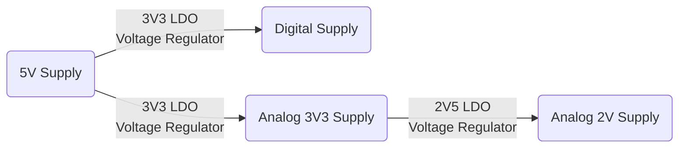

- - -

### General

layer 1 GND plane
layer 2 VCC plane, split digital en analog op de PCB, en teken dan een plane me 3v3 digitaal, en 3v3 analog, dan kan onkoppeling met via's. das kei goe gezien!

### Power Supply

### Audio Filtering

Use difference IC's for input and output buffers.

### Codec

HPSEL = 10 JD2

Single ended Non inverting input PGA should be connected to VMID.
(Closed when LMP2=0 & LMP3=0, or when muted)
