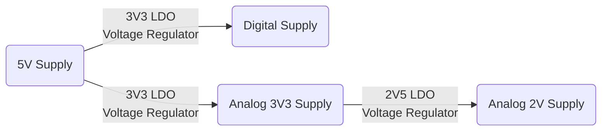

- - -

### Power Supply

```mermaid

flowchart LR
supply("5V Supply")
digital("Digital Supply")
analog3("Analog 3V3 Supply")
analog2("Analog 2V Supply")
supply-- 3V3 LDO \n Voltage Regulator --> digital
supply -- 3V3 LDO \n Voltage Regulator --> analog3
analog3 -- 2V5 LDO \n Voltage Regulator --> analog2
```

### Audio Filtering

Use difference IC's for input and output buffers.